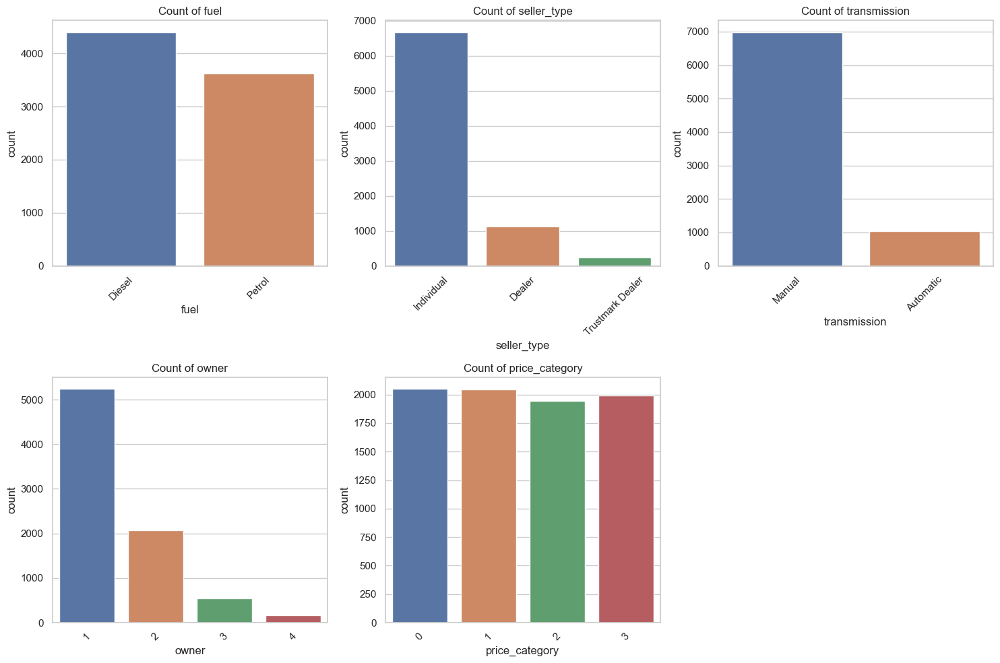
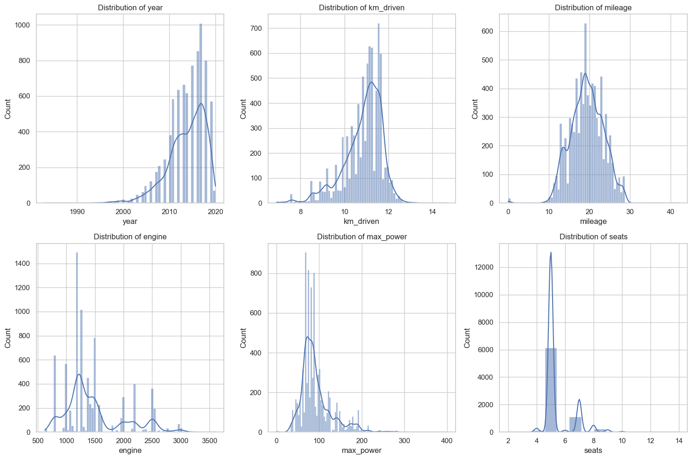
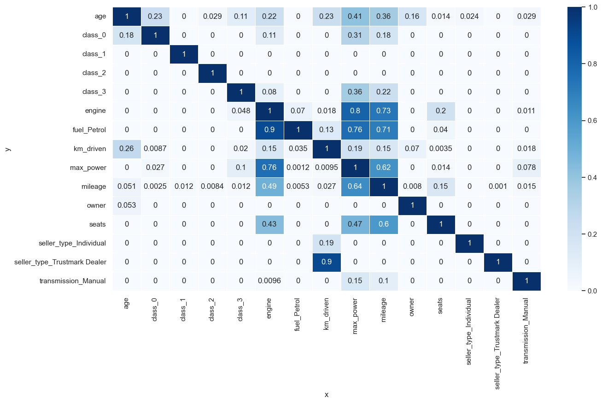
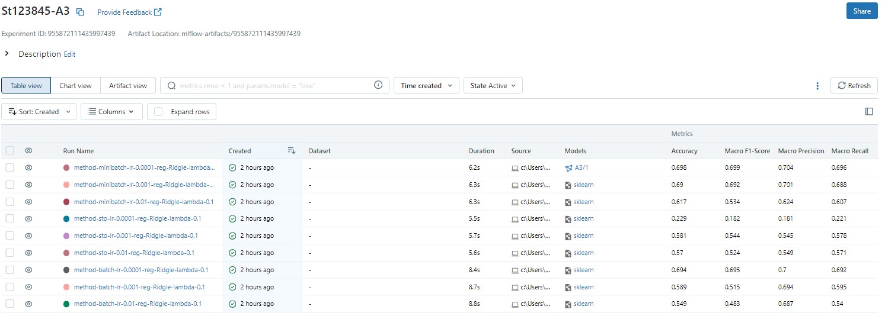
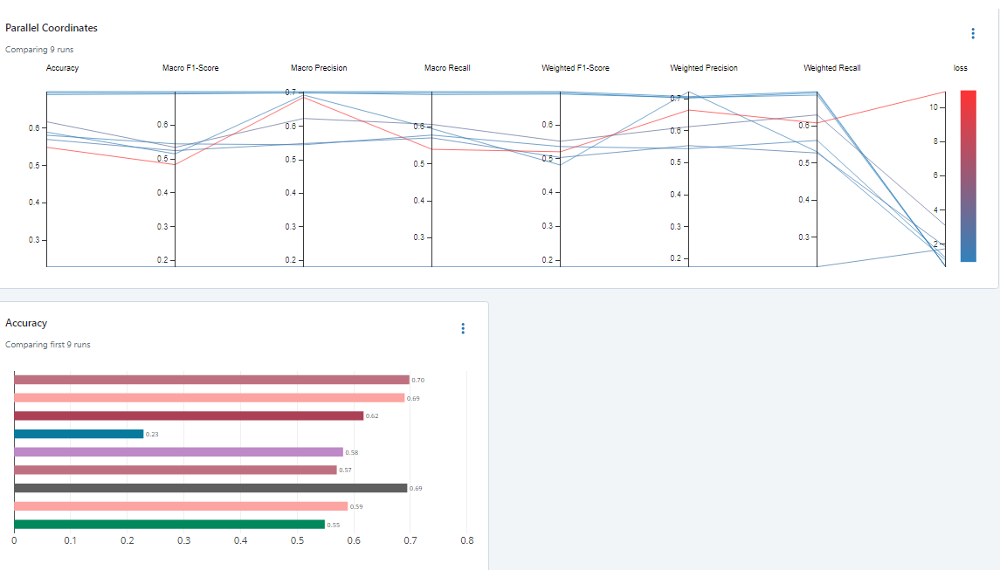
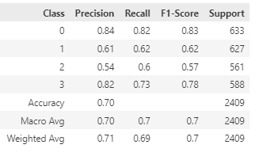
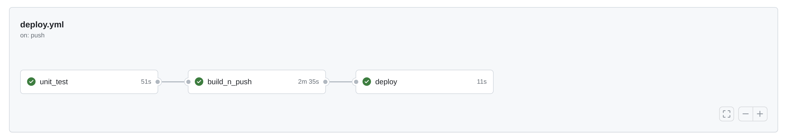
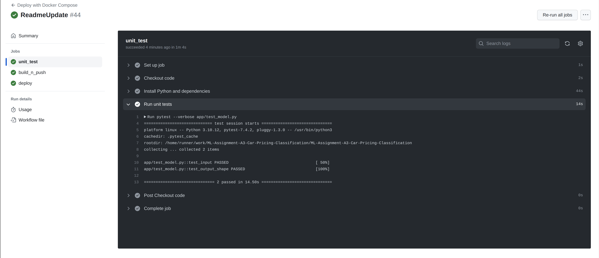
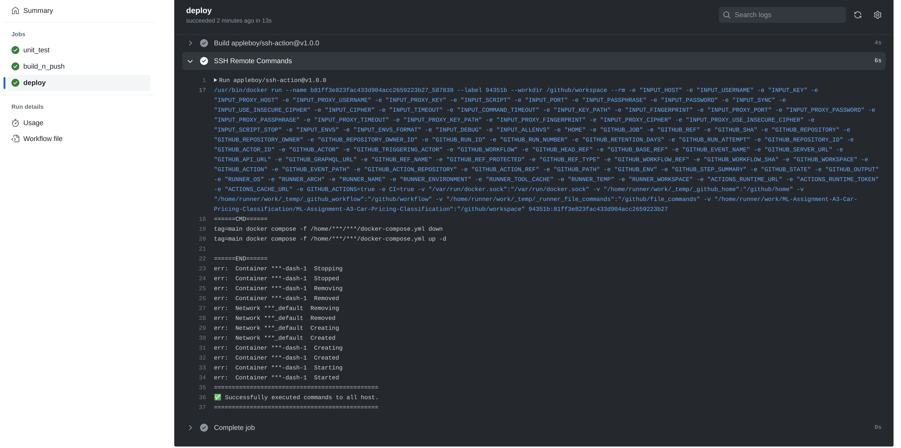
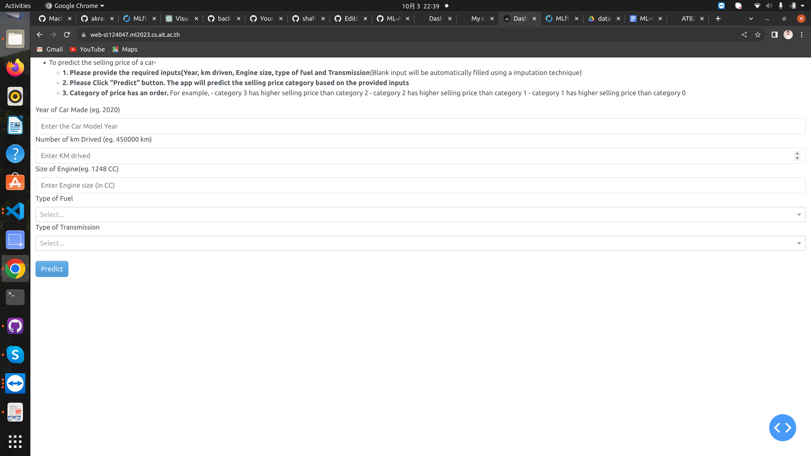

## ML-Assignment-A3-Car-Pricing-Classification with MLFLOW & CICD

*The CI/CD (Continuous Integration/Continuous Deployment) pipeline for deploying a machine learning model using MLflow and Docker. The pipeline consists of the following steps:*

# A3: Predicting Car Price

This is a continuation of A1 and A2, However, instead of predicting the direct car price, we will try to predict the multinomial classification. We will opt for a new model and also deploy the Deploy Dash Apllication fro Docker Container to AWS EC2 with GitHub Actions


The EDA is also done differently than the previous two assignments because of the new classification approach.







## 1. Training and Saving the Model: 

The machine learning model is trained and saved using MLflow. The trained model is stored locally ..

#### Some of the runs from MLFLOW and the comparison of various runs with their Accuracy, Precision, Racall, F1 scores and loss



- after checking all the runs Model the below configuration was registered for for stagging 

   ```{'method': 'minibatch', 'lr': 0.001, 'lambda': 0.1}``` 


```



## 2. Unit Testing: 
Unit tests are written to ensure that the model takes expected inputs and produces outputs with the expected shape.
## 3. Docker Image Building: 
A Docker image is created to package the trained model, MLflow server, and the application code.

## 4. Docker Image Pushing: 
The Docker image is pushed to a Docker container registry (e.g., Docker Hub) to make it accessible for deployment.

## 5. Deployment: 
The Docker image is deployed to a target environment ( ubuntu server) using Docker Compose by using Git Actions to automate this deployment process when changes are pushed to our repository. 
It was done by simply writing a yml file inside (.github/workflows).

Here our process is

    - First do an unit test 
    - If unit test runs well, then  build the docker and push to the docker hub
    - by using a docker compose file we deploy the docker in an ubuntu server.

- if the whole process goes well, the git action workflows looks like below - 



- Sucessful Unit testing 



- Sucessful Docker build and push 


- Sucessful Deployment on Ubuntu Server



- after the successful completion of worklow of git action, please check the Deployment (https://web-st124047.ml2023.cs.ait.ac.th/) 



This CI/CD pipeline provides an automated workflow for testing, packaging, and deploying a machine learning model using Docker and MLflow. By following these steps and incorporating automated testing and deployment, we can ensure a smooth and reliable deployment process for our machine learning applications.

## Setting Up the Environment

Before starting the pipeline, make sure to set up the environment by installing the necessary dependencies:

Python: Ensure you have Python installed on your local machine(Python version 3.8.17 or above).

MLflow: Install MLflow by running pip install mlflow.

Docker: Install Docker to build and push Docker images.

 ```pip install numpy==1.24.3
    pip install pandas==1.5.3
    pip install seaborn==0.12.2
    pip install matplotlib==3.7.2
    pip install scikit-learn==1.2.2
    pip install dash
    pip install dash_bootstrap_components
    pip install mlflow==2.7.1
```


### Run Locally Dash App Deployment 

All the files reqiured for setting up Dash deployment are in ```app``` directory. Need to open the terminal and navigate to the directory ```app```. Finally run the below command.

 ```
 python main.py
 ```
  Then, access the Dash Application: Once the script is running, open a web browser and visit **http://localhost:8080/**  to access the car selling price prediction web application.

  ### Docker Compose to run the app in a Docker Container Locally
Need to open terminal or command prompt and run the below command 


``````sh
docker compose up --build

```````

Access the app with **http://localhost:8080**


