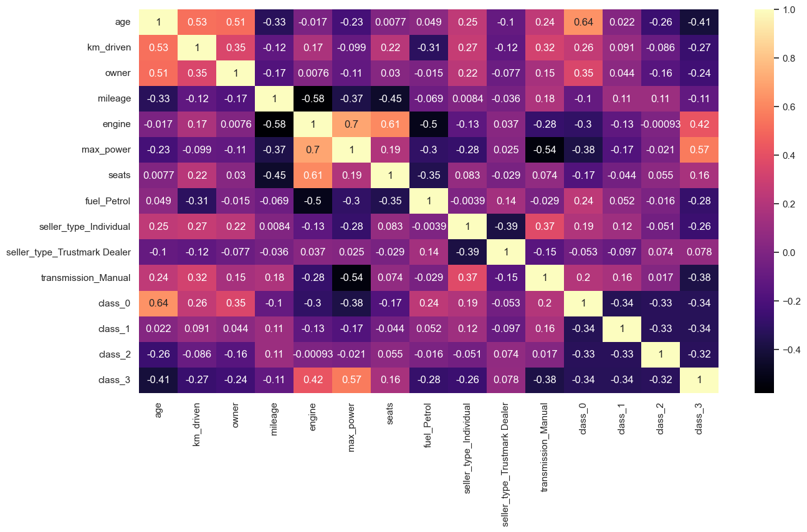
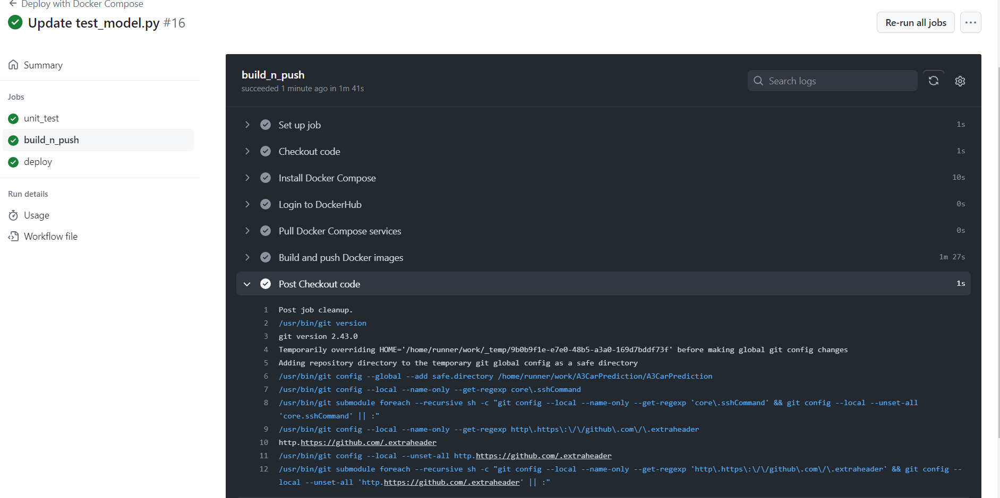
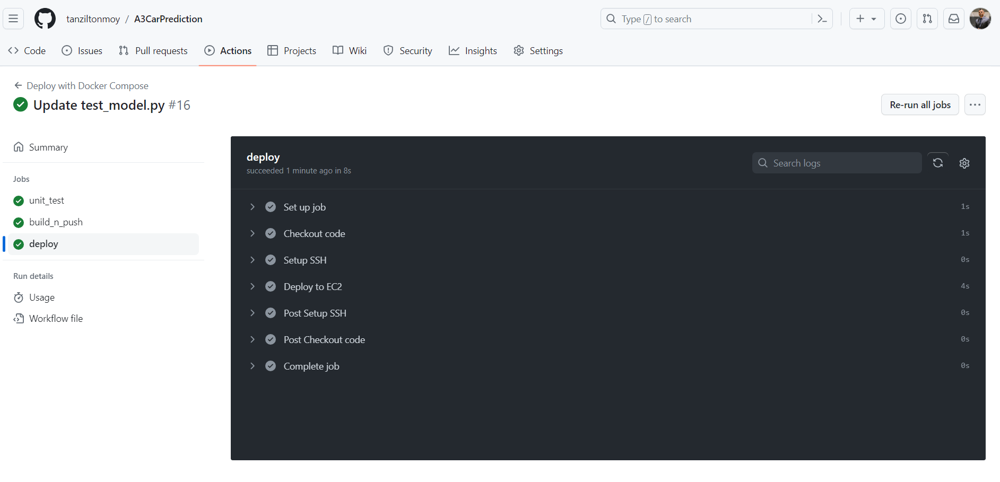

## ML-Assignment-A3-Car-Pricing-Classification with MLFLOW & CICD

*The CI/CD (Continuous Integration/Continuous Deployment) pipeline for deploying a machine learning model using MLflow and Docker. The pipeline consists of the following steps:*

# A3: Predicting Car Price

This is a continuation of A1 and A2, However, instead of predicting the direct car price, we will try to predict the multinomial classification. We will opt for a new model and also deploy the Deploy Dash Apllication fro Docker Container to AWS EC2 with GitHub Actions


The EDA is also done differently than the previous two assignments because of the new classification approach.





## 1. Training and Saving the Model: 

The machine learning model is trained and saved using MLflow. The trained model is stored locally ..

#### Some of the runs from MLFLOW and the comparison of various runs with their Accuracy, Precision, Racall, F1 scores and loss


- after checking all the runs Model the below configuration was registered for for stagging 

{'method': 'minibatch', 'lr': 0.001, 'lambda': 0.1}


Here our process is

    - First do an unit test 
    - If unit test runs well, then  build the docker and push to the docker hub
    - by using a docker compose file we deploy the docker in an ubuntu server.

- if the whole process goes well, the git action workflows looks like below - 

CICD


## Unit Testing: 


## Docker Image Building: 



## Deployment: 




- after the successful completion of worklow of git action, please check the Deployment (https://ec2-3-84-132-196.compute-1.amazonaws.com:8080/) 


### Run Locally Dash App Deployment 

All the files reqiured for setting up Dash deployment are in ```app``` directory. Need to open the terminal and navigate to the directory ```app```. Finally run the below command.

 ```
 python main.py
 ```
  Then, access the Dash Application: Once the script is running, open a web browser and visit **http://localhost:8080/**  to access the car selling price prediction web application.

  ### Docker Compose to run the app in a Docker Container Locally
Need to open terminal or command prompt and run the below command 


``````sh
docker compose up --build

```````

Access the app with **http://localhost:8080**


